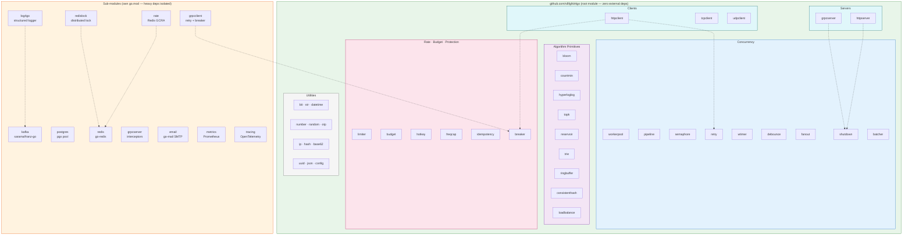

# Kit4go


[](https://goreportcard.com/report/github.com/v8fg/kit4go)
[](https://opensource.org/licenses/MIT)
[](https://github.com/v8fg/kit4go/releases)
[](https://github.com/v8fg/kit4go/actions/workflows/pr.yml?query=branch%3Arelease)
[](https://github.com/v8fg/kit4go)
[](https://github.com/v8fg/kit4go/actions/workflows/pr.yml?query=event%3Apush)
[](https://codecov.io/gh/v8fg/kit4go)
[](https://github.com/v8fg/kit4go/pulls)
[](https://sourcegraph.com/github.com/v8fg/kit4go?badge)
[](https://www.codetriage.com/v8fg/kit4go)
[](https://www.tickgit.com/browse?repo=github.com/v8fg/kit4go)

> Common Go utility library for ad-tech, finance, and blockchain infrastructure.

## Architecture



## Package list

### Root module (`github.com/v8fg/kit4go`)

| Category | Packages |
|----------|----------|
| **Concurrency** | [workerpool](workerpool) · [pipeline](pipeline) · [semaphore](semaphore) · [retry](retry) · [wtimer](wtimer) · [debounce](debounce) · [fanout](fanout) · [shutdown](shutdown) · [batcher](batcher) · [backpressure](backpressure) · [objpool](objpool) · [signalbus](signalbus) |
| **Algorithms** | [bloom](bloom) · [countmin](countmin) · [hyperloglog](hyperloglog) · [topk](topk) · [reservoir](reservoir) · [trie](trie) · [ringbuffer](ringbuffer) · [consistenthash](consistenthash) · [loadbalance](loadbalance) · [priorityqueue](priorityqueue) · [auction](auction) (2nd-price/multi-slot) · [fsm](fsm) |
| **Rate & budget** | [limiter](limiter) (token-bucket/sliding-window/fixed-window/leaky/GCRA) · [budget](budget) · [rate](rate) (Redis-backed) · [hotkey](hotkey) · [freqcap](freqcap) · [idempotency](idempotency) · [breaker](breaker) |
| **Cache & storage** | [cache](cache) (unified memory=lru/redis) · [lru](lru) · [shortlink](shortlink) |
| **Finance** | [money](money) (ISO-4217 fixed-point) · [decimal](decimal) (fixed-point, math/big) |
| **Clients** | [httpclient](httpclient) · [tcpclient](tcpclient) · [udpclient](udpclient) |
| **Servers** | [httpserver](httpserver) · [grpcserver](grpcserver) · [middleware](middleware) (request-id/ratelimit/CORS) |
| **Observability** | [latency](latency) (sharded tail-latency histogram) |
| **Utilities** | [bit](bit) · [datetime](datetime) · [file](file) · [ip](ip) · [json](json) · [number](number) · [str](str) · [uuid](uuid) · [xlo](xlo) · [random](random) · [otp](otp) · [base62](base62) · [hash](hash) · [config](config) · [maxprocs](maxprocs) · [backoff](backoff) · [health](health) · [stress](stress) · [featureflag](featureflag) · [errcode](errcode) · [hotreload](hotreload) · [signing](signing) |

### Sub-modules (own go.mod — heavy deps isolated)

| Module | What | Heavy deps |
|--------|------|------------|
| [log4go](log4go) | async structured logging (console/file/kafka/net/io, sampling, ShardLogger, circuit breaker + spill failover, ~1M qps/core) | sarama, sonic, goccy |
| [kafka](kafka) | producer + consumer (sync/async, group, partition; sarama/franz-go unified) | IBM/sarama |
| [postgres](postgres) | pgx pool wrapper | jackc/pgx/v5 |
| [clickhouse](clickhouse) | ClickHouse OLAP client wrapper (native protocol, PrepareBatch pass-through) | ClickHouse/clickhouse-go |
| [etcd](etcd) | etcd distributed-KV wrapper (service registration + discovery: KV/Lease/Watch) | etcd-io/etcd |
| [minio](minio) | S3/MinIO object-store client wrapper (Put/Get/Stat/Remove/List/Presign) | minio/minio-go |
| [redis](redis) | Redis client wrapper | redis/go-redis |
| [redislock](redislock) | distributed lock (token-guarded Lua, auto-renew, onLost) | redis/go-redis |
| [rate](rate) | Redis-backed GCRA rate limiter | redis/go-redis |
| [grpcclient](grpcclient) | gRPC client middleware (retry, breaker, metrics) | grpc, protobuf |
| [grpcserver](grpcserver) | gRPC server (interceptors, graceful shutdown) | grpc, protobuf |
| [email](email) | SMTP via go-mail (TLS Mandatory by default) | wneessen/go-mail |
| [metrics](metrics) | Prometheus wrapper | prometheus/client_golang |
| [tracing](tracing) | OpenTelemetry wrapper | go.opentelemetry.io/otel |
| [adaptive](adaptive) | CPU-aware worker-pool (scales to keep CPU under a target, leaves headroom for latency-critical paths) | shirou/gopsutil |

Importing `github.com/v8fg/kit4go/log4go` does **not** pull pgx or grpc into your
module graph — each sub-module owns only its own dependencies. Local development
uses a committed `go.work` so `go build`/`go test` resolve all modules together.

## Install

```sh
go get github.com/v8fg/kit4go                     # root utilities (50+ packages)
go get github.com/v8fg/kit4go/log4go              # structured logging (standalone)
go get github.com/v8fg/kit4go/kafka               # kafka producer/consumer (standalone)
go get github.com/v8fg/kit4go/postgres            # pgx pool (standalone)
go get github.com/v8fg/kit4go/redislock           # distributed lock (standalone)
```

## Quality

- **Deep concurrency audit**: 6 rounds, ~23 real bugs fixed (deadlocks, races, leaks, panics). See [QUALITY_RULES.md](QUALITY_RULES.md) for the framework.
- **log4go resilience**: circuit breaker + spill failover, observable degradation, bounded shutdown. See [log4go/RESILIENCE.md](log4go/RESILIENCE.md).
- **Callback-recover policy**: library-owned workers recover panics (`Recovered()` + `SetOnPanic`).
- **CI**: all 13 sub-modules, ubuntu + macOS, `-race`, `-short`.
- **Lint**: golangci-lint v2 with 11 high-signal linters.
- **Coverage**: 90%+ across root-module packages.

## Notes

> If test failed, maybe effected by the inline, you can try: `go test -v -gcflags=all=-l xxx_test.go`.

> Error-path tests use injectable interfaces (e.g. `file.FS`, `otp.RandomReader`,
> `ip.AddrLookup`, `random.CryptoSource`) with [mockery](https://github.com/vektra/mockery)
> mocks instead of runtime monkey-patching. Regenerate mocks with
> `go generate ./...` (mockery v2) after editing those interfaces. Each interface
> has a `//go:generate mockery ...` directive and a committed `mock_*.go`.

## CMD

- **release check**: `make`
- **coverage**: `make cover`
- **format check**: `make fmt-check`
- **format fixed**: `make fmt`
- **misspell check**: `make misspell-check`
- **golang lint**: `make golangci`
- **escape analysis**: `make escape` or `ESCAPE_PATH=ip make escape`
